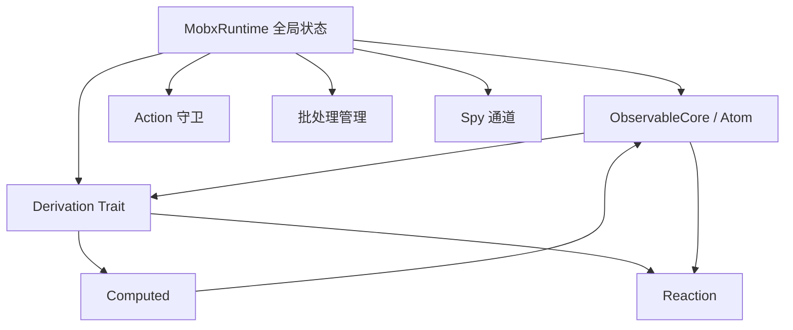
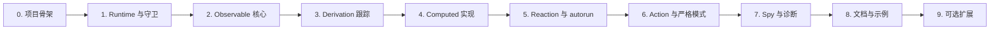

# Rust 版 MobX 核心复刻 —— 设计与实施计划

## 1. 目标

- **保持 MobX 核心语义**：完整复刻 Atom/Observable、Derivation、Computed、Reaction、Action、批处理与 spy 机制。
- **拥抱 Rust 特性**：以 trait + 结构体组合，适配所有权与借用规则，保留扩展性。
- **运行时解耦 UI**：核心 crate 专注数据流与调度，可被不同上层框架复用。
- **可预测行为**：延续懒计算、最小重算、严格模式校验与 reaction 调度顺序。

---

## 2. 架构概览



核心思路：`MobxRuntime` 统一保存追踪上下文与批处理信息；`Observable` 负责记录观察者集合；`Derivation` 抽象一切可派生计算；`Computed` 与 `Reaction` 共享依赖跟踪逻辑但承担不同职责；`Action`/`Batch` 控制状态写入窗口；`Spy` 提供调试事件流。

---

## 3. 核心模块与数据结构

### 3.1 `runtime` —— `MobxRuntime`

```rust
struct MobxRuntime {
    tracking_derivation: Option<DerivationId>,
    tracking_context: Option<TrackingContext>,
    run_id: u64,
    in_batch: usize,
    pending_unobservations: Vec<ObservableId>,
    pending_reactions: Vec<ReactionId>,
    is_running_reactions: bool,
    allow_state_changes: bool,
    allow_state_reads: bool,
    enforce_actions: EnforcePolicy,
    computed_requires_reaction: bool,
    reaction_requires_observable: bool,
    observable_requires_reaction: bool,
    disable_error_boundaries: bool,
    suppress_reaction_errors: bool,
    spy_listeners: Vec<SpyListener>,
    use_proxies: bool,
    safe_descriptors: bool,
}
```

- 单线程环境下通过 `thread_local! { RefCell<MobxRuntime> }` 暴露，无需 `Send` 约束即可保存 `Rc`/`Weak` 依赖。
- 当前阶段结构体保留 `run_id`、`in_batch`、`allow_state_changes`/`allow_state_reads`、`enforce_actions`、`tracking_derivation: Option<Weak<dyn Derivation>>`，并新增 `pending_reactions: Vec<ReactionId>` 与 `is_running_reactions` 标志位，统一管理 reaction 调度循环。
- 公开 `enqueue_reaction`、`next_pending_reaction`、`has_pending_reactions`、`set_running_reactions` 等内部辅助函数，方便 reaction 阶段复用。
- 提供 RAII 守卫：`AllowStateChangesGuard`、`AllowStateReadsGuard`、`BatchGuard`。
- `DerivationId`/`ObservableId`/`ReactionId` 使用以 `NonZeroU64` 封装的专用新类型，通过 `IdRegistry` 统一生成并管理，内部持有 `HashMap<Id, Weak<_>>` 映射。
- 运行时追踪 `run_id`、批处理深度与严格模式策略（`EnforcePolicy`），并暴露 `with_runtime`/`batch_depth` 等内部辅助函数。

### 3.2 `observable` —— `ObservableCore` 与 `Atom<T>`

```rust
trait ObservableCore {
    fn id(&self) -> ObservableId;
    fn name(&self) -> &str;
    fn report_observed(&self) -> bool;
    fn add_observer(&self, derivation: DerivationId);
    fn remove_observer(&self, derivation: DerivationId);
    fn report_changed(&self);
    fn on_become_observed(&self);
    fn on_become_unobserved(&self);
    fn observers(&self) -> Ref<Vec<DerivationId>>;
    fn diff_value(&self) -> u8;
    fn set_diff_value(&self, value: u8);
    fn is_being_observed(&self) -> bool;
    fn set_being_observed(&self, value: bool);
    fn is_pending_unobservation(&self) -> bool;
    fn set_pending_unobservation(&self, value: bool);
    fn lowest_observer_state(&self) -> DerivationState;
    fn set_lowest_observer_state(&self, state: DerivationState);
}
```

- `Atom<T>` 维护观察者集合、diff 标志与 `on_become_observed/unobserved` 钩子。
- `report_observed` 会检测正在追踪的 derivation，将 `ObservableId` 推入其 `new_observing`，并在绑定阶段通过 `with_observable`/`attach_observable` 辅助函数完成反向登记。
- `report_changed`：开启 batch → `propagate_changed` → `end_batch`，并通过 `with_derivation` 将观察者的 `dependencies_state` 标记为 `Stale`，触发 `on_become_stale`。
- 当前实现：基于 `Rc<RefCell<_>>` 的 `Atom` 支持观察者增删、生命周期钩子调用、`diff_value`/`lowest_observer_state` 维护，并通过线程局部的 `IdRegistry` 分配 `ObservableId`。

### 3.3 `derivation` —— `Derivation` 特征

```rust
enum DerivationState {
    NotTracking,
    UpToDate,
    PossiblyStale,
    Stale,
}
```

```rust
trait Derivation {
    fn id(&self) -> DerivationId;
    fn name(&self) -> &str;
    fn observing(&self) -> Ref<Vec<ObservableId>>;
    fn observing_mut(&self) -> RefMut<Vec<ObservableId>>;
    fn new_observing(&self) -> RefMut<Vec<ObservableId>>;
    fn set_new_observing(&self, deps: Vec<ObservableId>);
    fn dependencies_state(&self) -> DerivationState;
    fn set_dependencies_state(&self, state: DerivationState);
    fn run_id(&self) -> u64;
    fn set_run_id(&self, id: u64);
    fn unbound_deps_count(&self) -> usize;
    fn set_unbound_deps_count(&self, n: usize);
    fn on_become_stale(&self);
    fn is_tracing(&self) -> TraceMode;
    fn requires_observable(&self) -> bool;
}
```

- `track_derived_function`：设置 `tracking_derivation` → 执行函数 → `bind_dependencies` diff 依赖 → 恢复上下文。
- 默认辅助函数 `replace_observing` / `take_new_observing` 支持交换依赖列表并复用 `Vec` 内存。
- `should_compute`：依据 `DerivationState` 判断是否重算，`PossiblyStale` 分支会尝试调用依赖的 computed 值并根据结果更新状态。
- 线程局部 `DERIVATION_REGISTRY` 储存 `Weak<dyn Derivation>`，暴露 `reserve_derivation_id`、`attach_derivation`、`with_derivation` 供 observable 反向查找。

### 3.4 `computed` —— `Computed<T>`

- 同时实现 `ObservableCore` 与 `Derivation`：缓存值存放于 `Option<T>`，配合比较器 (`equals`)、`keep_alive`、`requires_reaction` 与运行状态位 (`is_computing`) 控制生命周期。
- `ComputedOptions` 提供 builder：`name`、自定义比较器、可选 setter 以及 `keep_alive`/`requires_reaction` 标志，`Computed::new` 返回引用计数句柄。
- `get()` 流程：
  1. 通过 `report_observed` 将自身注册到上游 derivation。
  2. 使用 `should_compute` 检测状态，必要时调用 `track_and_compute`。
  3. 读取缓存并返回 `Clone` 副本。
- `track_and_compute()`：借助 `track_derived_function` 收集依赖、比较新旧值并在变更时调用 `propagate_change` 标记下游观察者为 `Stale`。
- 当无观察者且 `keep_alive = false`，`suspend()` 会清空缓存并解绑依赖，延迟到下次访问再重新跟踪。

### 3.5 `reaction` —— `Reaction`

- `ReactionOptions` builder 提供 `name`、`requires_observable` 配置，`Reaction::new` 返回 `Rc<Reaction>` 并通过 `reserve_reaction_id` + `attach_reaction` 注册线程局部表。
- Reaction 同时实现 `Derivation`：维护 `observing/new_observing`、`dependencies_state`、`run_id`、`unbound_deps_count`、`is_scheduled`/`is_running`/`is_disposed` 状态位。
- `schedule()` 去重后调用 `runtime::enqueue_reaction`；`run()` 内部执行 `track_derived_function` 重新收集依赖并在需要时 `dispose()`。
- `run_pending_reactions()` 消费 `pending_reactions` FIFO 队列，利用 `runtime::set_running_reactions` 防止重入。
- 高层 `autorun` 返回 `ReactionHandle`（暴露 `run_now`/`schedule`/`dispose`），测试覆盖依赖追踪与调度去重。

### 3.6 `action` —— 动作包装

- `action(name, || { ... })` 函数提供 RAII 包装：`start_batch`、开启读写、执行用户逻辑、在析构时恢复。
- `run_in_action`/`allow_state_changes` 辅助函数保持与 JS API 一致，便于快速包裹一次性写入。
- `set_enforce_actions(ActionPolicy)`/`enforce_actions_policy()` 公开配置严格模式策略。
- 触发严格模式时记录警告，`drain_strict_mode_warnings()` 暴露收集到的诊断信息（同时打印到 stderr）。

### 3.7 `batch`

- `start_batch`/`end_batch` 管理 `in_batch` 计数。
- 当计数归零：
  1. 触发 `run_reactions`。
  2. 轮询 `pending_unobservations`，对无观察者的 observable 调用 `on_become_unobserved`，若是 computed 则执行 `suspend`。

### 3.8 `spy`

- `SpyEvent` 枚举涵盖 action start/end、reaction 调度与执行、computed 计算、observable 读写，以及严格模式告警。
- `spy::register(listener)` 注册监听，返回 `SpySubscription`，可通过 `dispose()` 或 Drop 自动注销；`spy::is_enabled()` 快速判定是否存在监听。
- 运行时在 `action`、`Atom::report_observed/changed`、`ComputedInner::track_and_compute` 与 `Reaction::schedule/run/dispose` 中发出事件，仅在监听器存在时执行，避免额外开销。

---

## 4. 核心调用流程

1. **依赖跟踪**：`track_derived_function`
   - 设置运行时追踪上下文 → 执行用户函数 → `bind_dependencies` 增量更新依赖表 → 发出缺少 observable 警告。
2. **Observable 读取**：`report_observed`
   - 在 derivation 跟踪期记录依赖，推入 `new_observing`，必要时触发 `on_become_observed`。
3. **Observable 写入**：`report_changed`
   - 在严格模式下优先通过 `record_strict_mode_violation` 记录告警，然后标记 `lowest_observer_state`，调用 `propagate_changed/confirmed/maybe` 通知观察者 → `run_reactions`。
4. **Computed 取值**：
   - 根据追踪状态决定直接取缓存或重新跟踪计算，并使用比较器决定是否传播变更。
5. **Reaction 调度**：
   - `on_become_stale` → `schedule` → `run_reactions` 循环执行，限流 `MAX_REACTION_ITERATIONS`。
6. **Action 窗口**：
   - 在 `_start_action` 中允许写入，`_end_action` 恢复读写标志并触发批处理尾声。
7. **Spy 分发**：`spy::report` 快照监听器列表并广播 `SpyEvent`，避免持有运行时借用期间回调执行。

---

## 5. API 面向使用者

- `observable::value::ObservableValue::new(name, initial)` 提供简单的可观察容器。
- `Atom::new(name, on_observed, on_unobserved)` 创建最小可观察单元（内部使用场景）。
- `Computed::new(options)`：支持 getter、可选 setter、比较器、上下文、`keep_alive` 与 `requires_reaction`。
- `autorun`、`reaction` 高阶 API：内部创建 `Reaction` 并返回 disposer。
- `action(name, f)`、`run_in_action` 控制状态写入窗口。
- `batch(f)` RAII 辅助一次性执行多次写入。
- `spy::register(listener)` 返回 `SpySubscription`，`spy::is_enabled()` 可判断监听是否启用。

---

## 6. 并发与安全

- **默认单线程**：使用 `Rc<RefCell<...>>`，与 JavaScript 版行为一致；文档中明确互斥限制。
- **可选并发**：通过 feature `sync` 切换为 `Arc<parking_lot::Mutex<...>>`，增加 Send/Sync 要求。
- **异常语义**：借助 `catch_unwind` 模拟 `CaughtException`，与 `disable_error_boundaries` 配置对齐。
- **借用保护**：封装内部可变性，必要时提供返回 `Result` 的 API，避免 `RefCell` panic。

---

## 7. Spy 与诊断能力

- `TraceMode`：`None` / `Log` / `Break`，配合 `trace(derivation, breakpoint)` 输出依赖树。
- `get_dependency_tree` / `get_observer_tree`：用于调试展示。
- 所有调试输出与 spy 事件受编译开关或配置控制，避免生产开销。

---

## 8. 实施计划



- **Phase 0**：建立 crate 结构、实现 `NonZeroU64` ID 新类型与通用 `IdRegistry` 接口（已完成：crate 布局、ID 类型宏、注册表实现）。
- **Phase 1**：`MobxRuntime`、守卫、batch 基础，测试读写开关（已完成：runtime thread-local、读写守卫、批处理测试）。
- **Phase 2**：实现 `ObservableCore` 与 `Atom`，测试依赖登记（已完成：线程局部 `IdRegistry`、`report_observed/changed`、观察者生命周期、对外 `ObservableValue` 封装）。
- **Phase 3**：完成 `track_derived_function`、`bind_dependencies`、`should_compute`（已完成：线程局部 runtime + 依赖绑定单元测试）。
- **Phase 4**：实现 `Computed` 缓存、比较器、setter 行为（已完成：`ComputedOptions` builder、依赖重绑定、单元与集成测试）。
- **Phase 5**：实现 `Reaction`、`autorun`，调度循环与循环检测（已完成：reaction registry、`autorun` 句柄、`run_pending_reactions` 队列与调度测试）。
- **Phase 6**：`action` 包装、严格模式警告（已完成：action API、严格模式警告收集管线）。
- **Phase 7**：`SpyEvent`、trace/调试 API（已完成：`spy::register` 监听、`SpyEvent` 生命周期、严格模式事件）。
- **Phase 8**：Rustdoc、示例、CI (`cargo fmt/clippy/test`)（已完成：`examples/spy_action.rs`、`scripts/ci.sh`）。
- **Phase 9**（可选）：线程安全特性、集合类型、UI 绑定。（进行中：`sync` feature 引入 `Arc<RwLock>`/`Mutex` 后端、reaction scheduler 钩子与跨线程测试；新增 `observable::collections::ObservableVec/Map/Set`，提供结构 diff + 元素级依赖追踪。）

---

## 9. 测试策略

- **单元测试**：覆盖 runtime 守卫、observable diff、computed 缓存、reaction 调度、action 嵌套。
- **集成测试**：重现 MobX 示例（计时器、Todo store 等）。
- **严格模式**：验证非 action 写入时的警告输出。
- **循环检测**：构造自触发 reaction，确认 `MAX_REACTION_ITERATIONS` 生效。

---

## 10. 开发工作流

- `cargo doc --no-deps`：检查 Rustdoc 生成与公开 API 注释的完整性。
- `examples/spy_action.rs`：演示 spy 监听与 action 生命周期，运行方式 `cargo run --example spy_action`。
- `scripts/ci.sh`：本地一键执行 `cargo fmt --all`、`cargo clippy --all-targets --all-features -D warnings`、`cargo test --all`，与预计的 CI 步骤保持一致。
- **Spy**：监听事件顺序与载荷。

---

## 10. 交付清单

- `mobx_core` 源码与 Rustdoc 文档。
- 全量测试用例与 CI 配置。
- 示例项目（计数器、computed + reaction）。
- README：介绍架构、API、配置、与 MobX JS 的对应关系。
- 可选附加：线程安全特性、集合类型扩展、devtools 指南。

---

## 11. 工具与依赖

- Rust 1.75+。
- 依赖建议：`once_cell`、`thiserror`、`parking_lot`（可选 feature）、`log`/`tracing`（调试）。
- CI：`cargo fmt`、`cargo clippy --all-targets`、`cargo test`。

---

## 12. 预估时间表

| 阶段 | 时长 | 关键成果 |
|------|------|-----------|
| 0-1  | 1 周 | Runtime 结构、批处理守卫 |
| 2-3  | 1 周 | Observable 与 Derivation 基础 |
| 4    | 1 周 | Computed 功能完整 |
| 5    | 1 周 | Reaction 调度与 autorun |
| 6-7  | 1 周 | Action、严格模式、spy |
| 8    | 1 周 | 文档、示例、稳定性测试 |
| 9+   | 可选 | 线程安全、集合类型、UI 绑定 |

---

## 13. 风险与对策

- **RefCell 借用冲突**：封装访问，提供错误返回，必要时引入自定义借用检查。
- **反应循环**：严格执行 `MAX_REACTION_ITERATIONS`，暴露可配置项并记录错误。
- **错误传播差异**：与 JS 版保持一致，允许通过配置关闭错误边界。
- **性能**：优化 `new_observing` 分配（`Vec::with_capacity`、`SmallVec`），监控 `track_derived_function` 热路径。

---

## 14. 后续扩展方向

- `make_auto_observable` 风格宏或派生。
- `flow`/异步流程支持。
- `to_js`/序列化工具链。
- DevTools 集成（基于 `SpyEvent` 的可视化、远程调试）。
